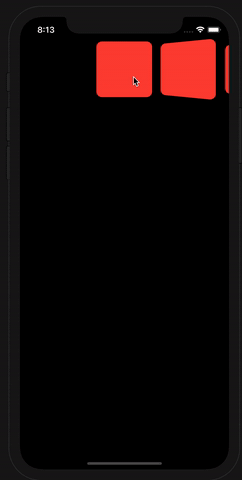
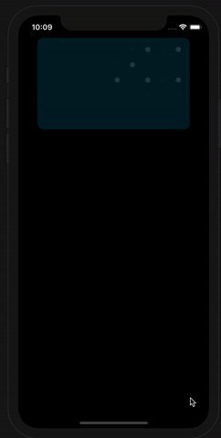

# PagerView3DEffect
## Info
pager view like iTunes paging in SwiftUI 
## Demo


## Setup

```swift
PagerView3DEffect(selection: $index, items , spacing: 10) { item in
    Rectangle()
        .foregroundColor(.red)
        .cornerRadius(10)
        .frame(width: 100, height: 100, alignment: .center)         
}
```
## Contact

[Twitter](https://www.twitter.com/ATMasoumi)
